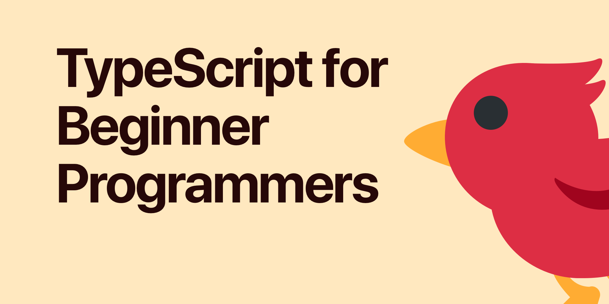
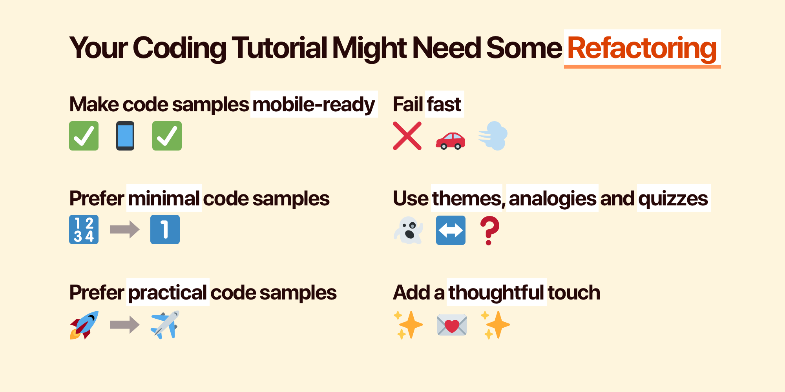
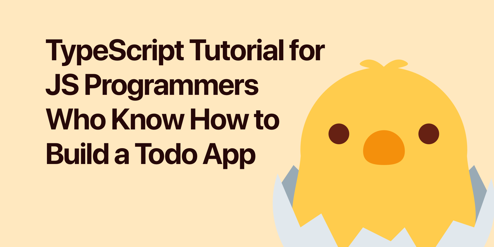
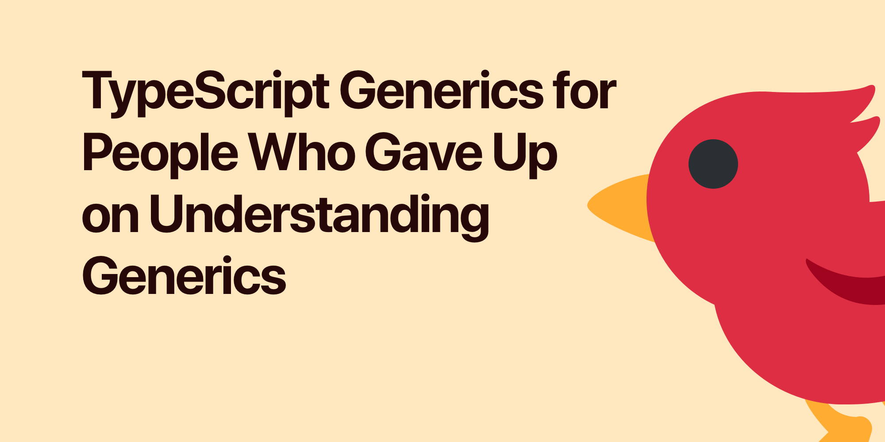

# [TypeScript for Beginner Programmers](https://ts.chibicode.com)

This is the repository for the TypeScript tutorial website called **[TypeScript for Beginner Programmers](https://ycombinator.chibicode.com/)**.

  

## Article 3: [Your Coding Tutorial Might Need Some Refactoring](https://ts.chibicode.com/refactor)

  

## Article 2: [TypeScript Tutorial for JS Programmers Who Know How to Build a Todo App](https://ts.chibicode.com/todo)

  

## Article 1: [TypeScript Generics for People Who Gave Up on Understanding Generics](https://ts.chibicode.com/generics)

  

## License & Credits

- For emojis, I’m using [Twemoji](https://github.com/twitter/twemoji) by Twitter (CC-BY 4.0 license).
- The text for this website is licensed under [CC BY-NC-SA 4.0](https://creativecommons.org/licenses/by-nc-sa/4.0/).
- Everything else is licensed under the [MIT](LICENSE-non-text.txt) license.

## Author

**Shu Uesugi**

- [Website](https://chibicode.com)
- Twitter: [@chibicode](https://twitter.com/chibicode)
- Email: [shu@chibicode.com](mailto:shu@chibicode.com)